# Configure IPv4 & IPv6 with VM-Series on Google Cloud

This tutorial shows how to deploy and configure Palo Alto Networks VM-Series to secure IPv4 and IPv6 traffic on Google Cloud. 

This guide is intended for network administrators, solution architects, and security professionals who are very familiar with [Compute Engine](https://cloud.google.com/compute) and [Virtual Private Cloud (VPC) networking](https://cloud.google.com/vpc).


## Requirements

The following are required for this tutorial:

1. A Google Cloud project. 
2. Access to Google Cloud Shell to deploy the resources.
3. If using BYOL, an VM-Series authkey to license the firewall.

## Architecture

The diagram shows the resources created with Terraform.  

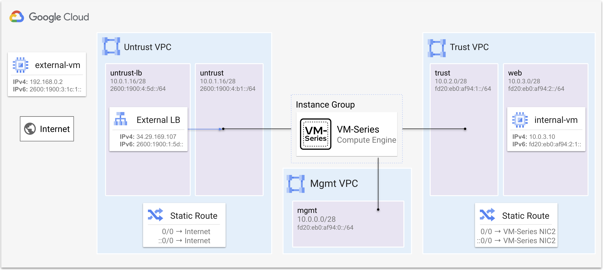

The VM-Series has 3 network interfaces, each belonging to a dual-stack subnet, and belongs to an unmanaged instance group which serves as the backend service of a external pass-through load balancer.  The load balancer is configured with IPv4 and IPv6 frontend addresses to distribute internet inbound traffic to the VM-Series untrust interface. 

Test workloads are deployed to test north/south traffic.  The `external-vpc` contains an Ubuntu VM to test internet inbound traffic through the VM-Series to the `internal-vm` in the trust network. 

>[!WARNING]
>At the time of this writing, IPv6 traffic cannot be routed to an internal load balancer as the next hop.


## Prepare for Deployment

On your local machine or in Google Cloud Shell, perform the following.

1. Enable the required APIs, generate an SSH key, and clone the repository. 

    ```
    gcloud services enable compute.googleapis.com
    git clone https://github.com/mattmclimans/gcp-vmseries-ipv6
    cd gcp-vmseries-ipv6
    ```

2. Create an SSH key to assign to the GCE instances created.

    ```
    ssh-keygen -f ~/.ssh/vmseries-tutorial -t rsa
    ```

3. Create a `terraform.tfvars`.

    ```
    cp terraform.tfvars.example terraform.tfvars
    ```

4. Edit the `terraform.tfvars` file and set values for the following variables:


    | Key                     | Value                                                                                | Default                        |
    | ----------------------- | ------------------------------------------------------------------------------------ | ------------------------------ |
    | `project_id`            | The Project ID within Google Cloud.                                                  | `null`                         |
    | `public_key_path`       | The local path of the public key you previously created                              | `~/.ssh/vmseries-tutorial.pub` |
    | `mgmt_allow_ips`        | A list of IPv4 addresses that can have access to the VM-Series management interface. | `["0.0.0.0/0"]`                |
    | `create_test_vms`       | Set to `false` if you do not want to create the test VMs.                            | `true`                         |
    | `vmseries_image_name`   | Set to the VM-Series image you want to deploy.                                       | `vmseries-flex-bundle1-1102`   |

1. Save your `terraform.tfvars` file.


## Deployment
When no further changes are necessary, deploy the resources:

1. Initialize and apply the Terraform plan.  

    ```
    terraform init
    terraform apply
    ```

2. Enter `yes` to start the deployment.
   
3. After the resources are created, Terraform displays the following message:

    ```
    Apply complete!

    Outputs:

    EXTLB_IPv4      = "1.2.3.4/32"
    EXTLB_IPv6      = "2600:1900:4000:eba6:8000::/32"
    SSH_INTERNAL_VM = "gcloud compute ssh paloalto@internal-vm  --zone=us-central1-a"
    SSH_EXTERNAL_VM = "gcloud compute ssh paloalto@external-vm  --zone=us-central1-a"
    VMSERIES_CLI    = "ssh admin@1.1.1.1 -i ~/.ssh/vmseries-tutorial"
    VMSERIES_GUI    = "https://1.1.1.1"
    ```

### Accessing the VM-Series firewall

To access the VM-Series user interface, a password must be set for the `admin` user.

> [!NOTE]
> It may take an additional 10 minutes for the VM-Series to be accessible.

1. Use the `VMSERIES_CLI` output to access the VM-Series CLI.

    ```
    ssh admin@1.1.1.1 -i ~/.ssh/vmseries-tutorial
    ```
    

2. On the VM-Series, set a password for the `admin` username. 

    ```
    configure
    set mgt-config users admin password
    ```

3. Commit the changes.
    
    ```
    commit
    ```

5. Enter `exit` twice to terminate the session.

6. In a browser, use the `VMSERIES_GUI` output to access the VM-Series. 


## Outbound IPv4/IPv6 Traffic Configuration

In this step, retrieve the required network parameters and apply them to the VM-Series configuration.

> [!TIP]
> DHCPv6 is available in PAN-OS 11.0 and eliminates the need to configure static IPv6 addresses.

### Configure Interfaces

Enable DHCPv4 and DHCPv6 on the VM-Series network interfaces to handle IPv4/IPv6 traffic. 

1. On the VM-Series, go to **Network → Zones**. Click **Add**.

2. Create two zones: `untrust` & `trust`.

    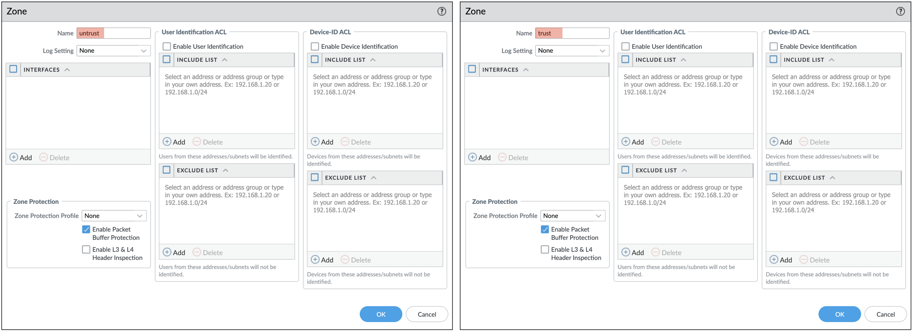

3. Go to **Network → Interfaces → Ethernet**. 

4. Configure `ethernet1/1` (`untrust`) as follows:

    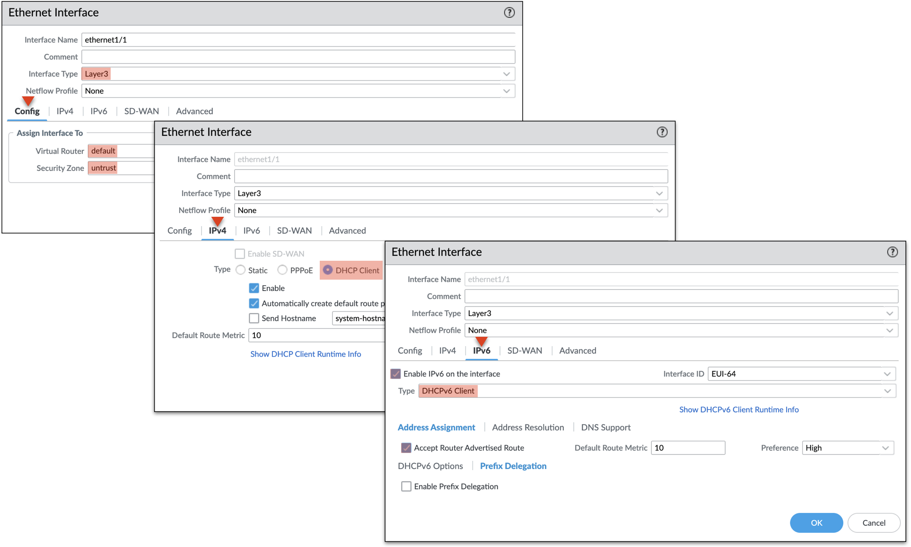

    > In IPv4 tab, **check** `Automatically create default route`. </br>
    > In IPv6 tab, **check** `Accept Router Advertised Route` and **uncheck** `Enable Prefix Delegation`.

5. Configure `ethernet1/2` (`trust`) as follows:

    

    > In IPv4 tab, **uncheck** `Automatically create default route`. </br>
    > In IPv6 tab, **uncheck** `Accept Router Advertised Route` and **uncheck** `Enable Prefix Delegation`.

6. **Commit the changes.**


### Retrieve IPv6 Parameters

Retrieve the default gateways for the untrust & trust subnets and the ULA for the trust VPC. 

1. On `ethernet1/1`, click **Dynamic-DHCPv6 Client**.

2. Record the **Server** and **IPv6 Address (Non-Temporary)** addresses.

    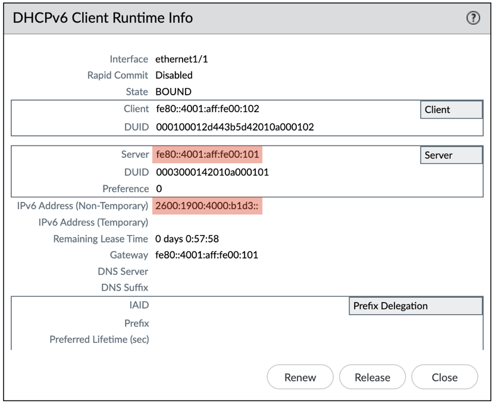

    > **Server** address is the IPv6 default gateway for the untrust network.<br>
    > **IPv6 Address** is the external IPv6 address assigned to the untrust interface.

3. On `ethernet1/2`, click **Dynamic-DHCPv6 Client**.

4. Record the **Server** address.

    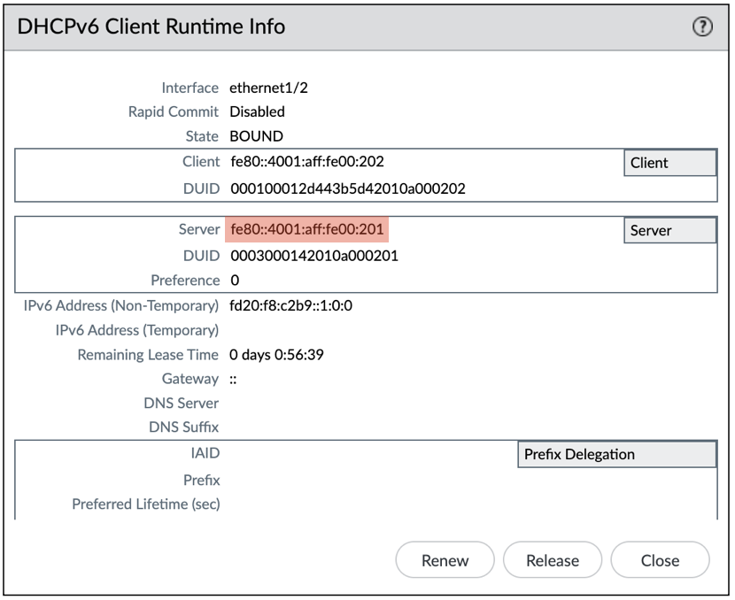

    > **Server** address is the IPv6 default gateway of the trust network.

5. In to Google Cloud, go to **VPC Networks →** `trust-vpc`.

6. Record the **VPC network ULA internal IPv6 range**.

    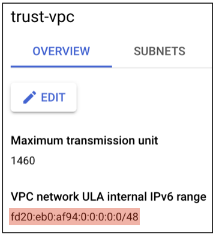

    > The ULA covers all of the possible IPv6 prefixes within the trust VPC.

### Configure Virtual Router

On the VM-Series, create an IPv4 & IPv6 routes to correctly return traffic to the trust VPC.

1. Go to **Network → Virtual Routers**.  Select the `default` virtual router. 

2. Click **Static Routes → IPv4**.  Click **+ Add**. 

3. Configure the IPv4 return route as follows:

    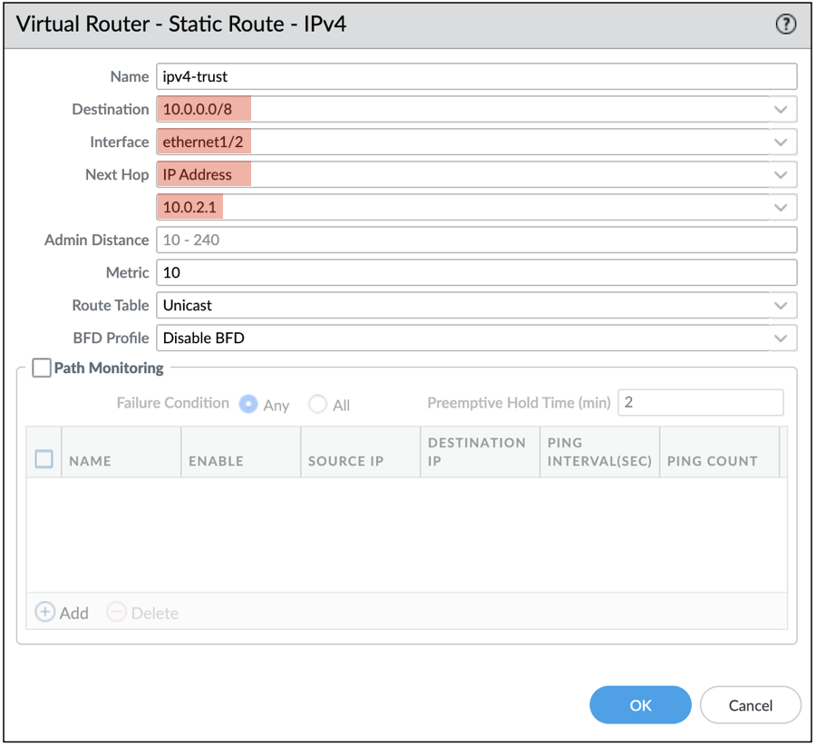

4. Click **Static Routes → IPv6**.  Click **+ Add**. 

5. Configure the IPv6 return route as follows:

    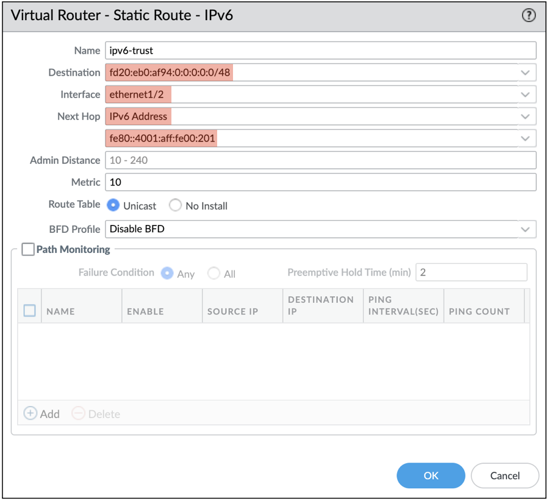

    |                    | IPv4 Route                          | IPv6 Route                   |
    |--------------------|-------------------------------------|------------------------------|
    | **Name**           | `ipv4-trust`                        | `ipv6-trust`                 |
    | **Destination**    | `IPv4 CIDR of trust network`        | `ULA range of trust VPC`     |
    | **Next Hop**       | `IP Address`                        | `IPv6 Address`               |
    | **Next Hop Value** | `eth1/2 IPv4 gateway IP`            | `eth1/2 IPv6 Server Address` |

6.  Click **OK**.


### Configure IPv4/IPv6 NAT Policies for Outbound Traffic

Create a NAT rule to translate trust VPC traffic to the external IPv4/v6 addresses attached to the untrust interface. 

1. Go to **Policies → NAT**.  Click **Add**.

2. Create a NAT policy to translate outbound IPv4 traffic.

    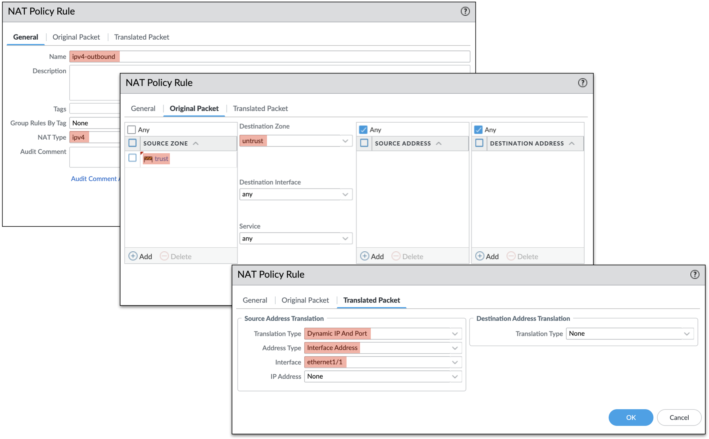

3. Create a NPTv6 NAT policy to translate outbound IPv6 traffic.  

    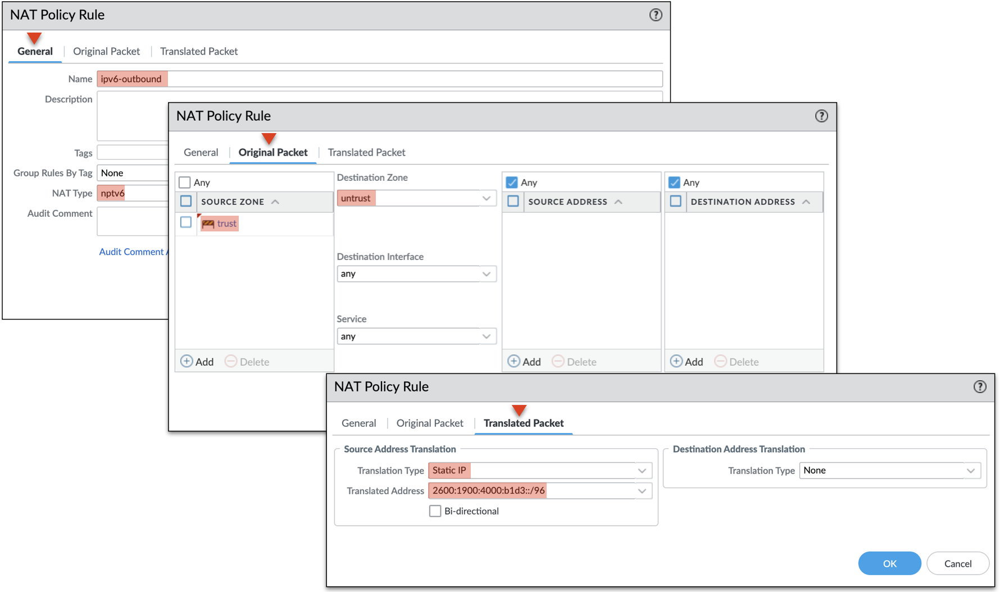

    >Set the **IPv6 Address (Non-Temporary)** IP on `eth1/1` as the translated address (use a `/96` prefix).

### Create Security Policy

For the purposes of this tutorial, create a security policy to allow `ping`, `ping6`, & `web-browsing`. 

>[!CAUTION]
>This tutorial does not provide guidance on security policy implementation. 


1. Go to **Policies → Security**. Click **Add**.

2. Configure the security policy to allow `ping`, `ping6`, & `web-browsing`.

    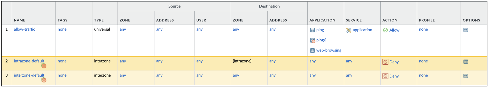

4. **Commit the changes**.

5. In Cloud Shell, create default routes in the `trust-vpc` to steer IPv4/IPv6 traffic to the VM-Series trust interface for inspection. 
    
    ```
    gcloud compute routes create ipv4-default \
        --network=trust-vpc \
        --destination-range=0.0.0.0/0 \
        --next-hop-instance=vmseries \
        --next-hop-instance-zone=us-central1-a

    gcloud beta compute routes create ipv6-default \
        --network=trust-vpc \
        --destination-range=::0/0 \
        --next-hop-instance=vmseries \
        --next-hop-instance-zone=us-central1-a
    ```


### Test Outbound Internet Traffic

Access the `internal-vm` in the trust network and generate outbound IPv4/IPv6 internet traffic.

1. In Cloud Shell, SSH to the `internal-vm`.

    ```
    gcloud compute ssh paloalto@internal-vm --zone=us-central1-a
    ```

2. Ping an external IPv4 address to test outbound IPv4 traffic. 

    ```
    ping 8.8.8.8 
    ```

3. Ping an external IPv6 address to test outbound IPv6 traffic. 

    ```
    ping6 2600::
    ```

4. On the VM-Series, go to **Monitor → Traffic**.  Enter the filter below to search for the outbound traffic. 

    ```
    ( app eq 'ping6' ) or ( app eq 'ping' )
    ```

    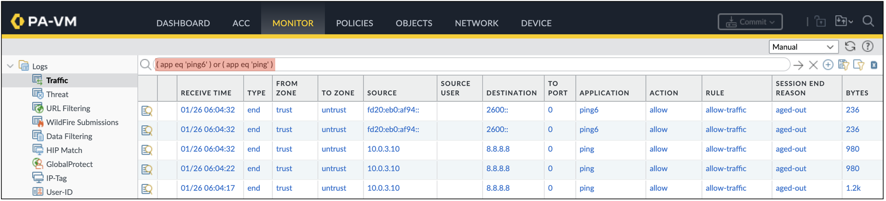

    >You should see that IPv4 & IPv6 traffic from the `internal-vm` is translated correctly by the VM-Series.


## Inbound IPv4/IPv6 Traffic Configuration
In this section, you will configure the VM-Series to translate inbound internet traffic, which is distributed by an external pass-through load balancer, to reach the a web application running on the `internal-vm` in the trust VPC.

>[!NOTE]
>The Terraform plan creates an external load balancer and health check for you.


### Configure Health Checks
Setup a loopback interface to receive the load balancer's IPv4/IPv6 health checks. Then, create a NAT policy to translate IPv4 health checks to the IPv4 loopback address and create a security policy to allow the health checks.

#### Configure loopback interface

1. In Google Cloud, go to **Network Services → Load Balancers**. 

2. Click the `vmseries-extlb` load balancer. Record the IPv6 address assigned to the forwarding rule.

    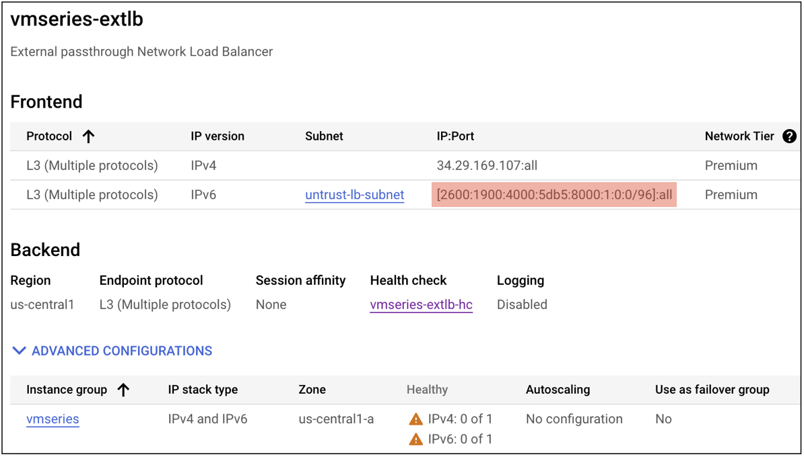

3. On the VM-Series, go to **Network → Zones**. Click **Add**.

4. Create a zone called `lb-checks`.

    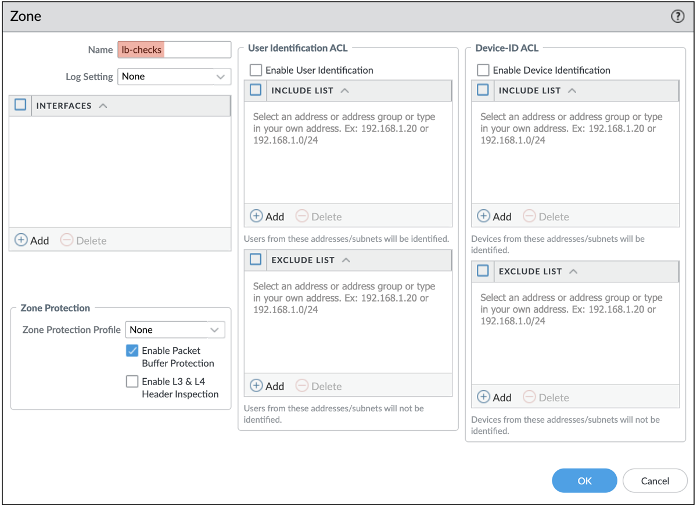

5. Go to **Network → Network Profiles → Interface Mgmt**. click **Add**.

6. Enable `HTTP` and add the [Health Check Ranges](https://cloud.google.com/load-balancing/docs/health-checks#fw-netlb) (`35.191.0.0/16`, `209.85.152.0/22`, `209.85.204.0/22`, `2600:1901:8001::/48`) as permitted addresses.
    
    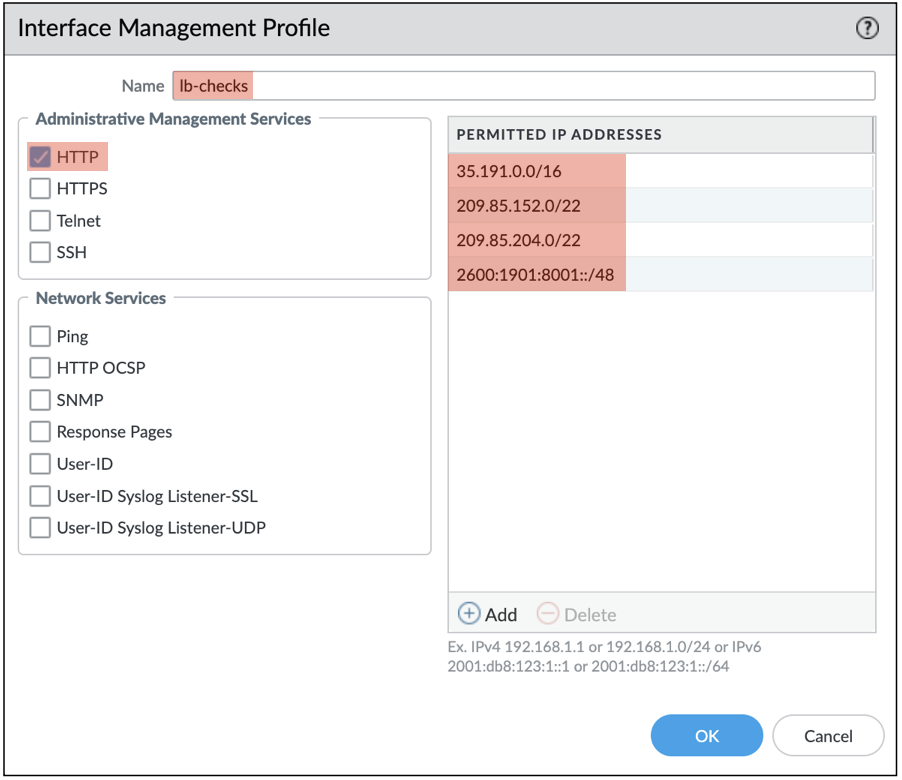

7. Go to **Network → Interfaces → Loopback**. Click **Add**.

8. In the **Config Tab**, set tunnel to `1`, **Virtual Router** to `default`, & **Zone** to `lb-checks`.
    
    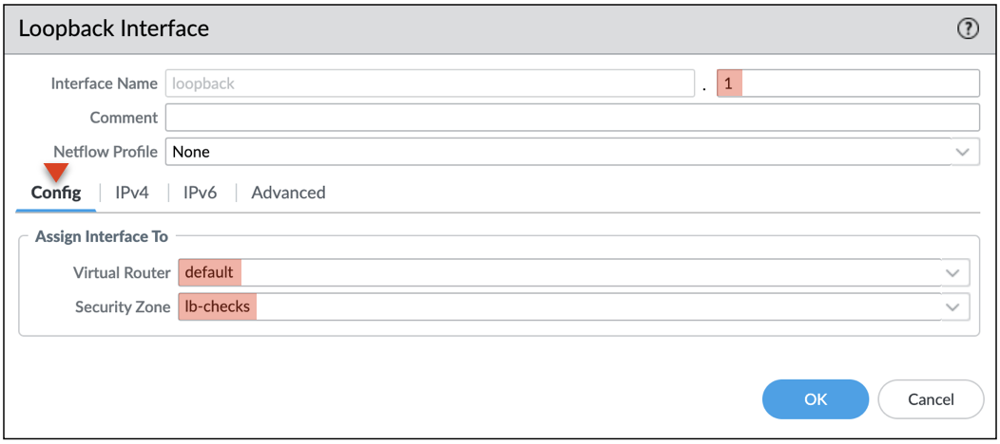

9. In the **IPv4 Tab**, set `100.64.0.1/32` as the address.
    
    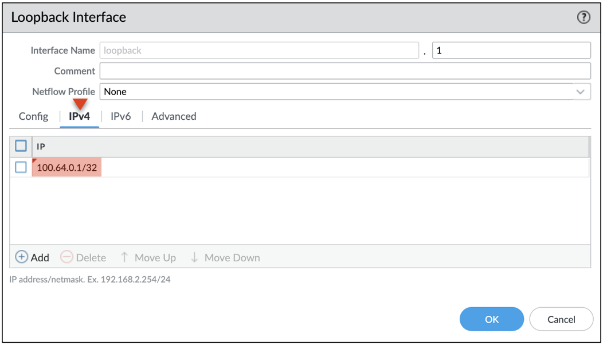

10. In the **IPv6 Tab**, set load balancer's IPv6 forwarding rule address.
    
    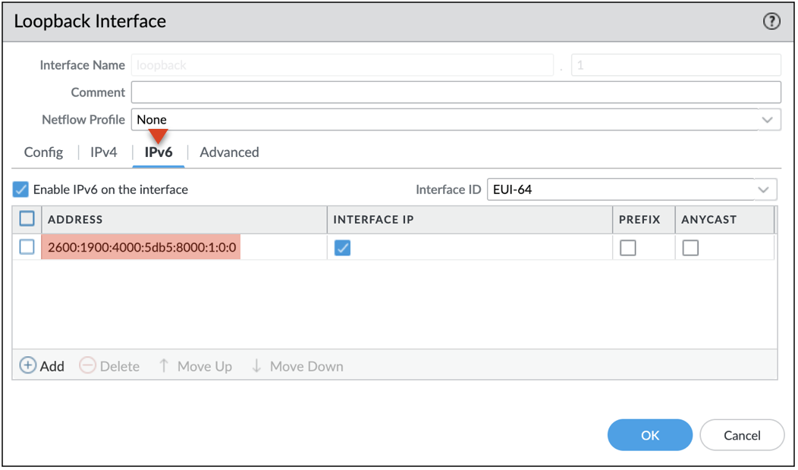

11. In the **Advanced Tab**, set the **Management Profile** to `lb-checks`

    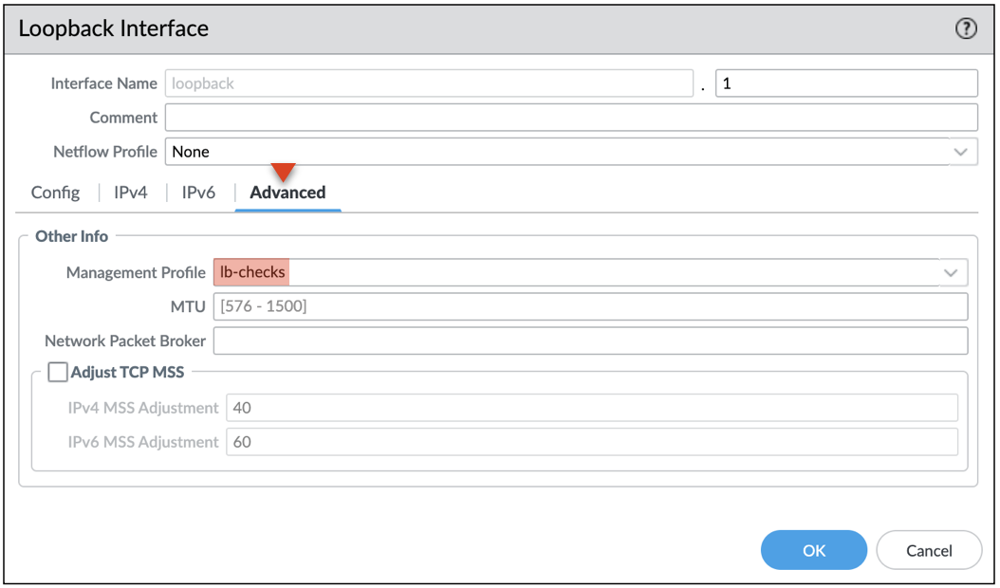


#### Create NAT for IPv4 Health Checks

1. Go to **Policies → NAT**. Click **Add**.

2. Configure the policy to translate the IPv4 health check ranges to the IPv4 loopback address.

    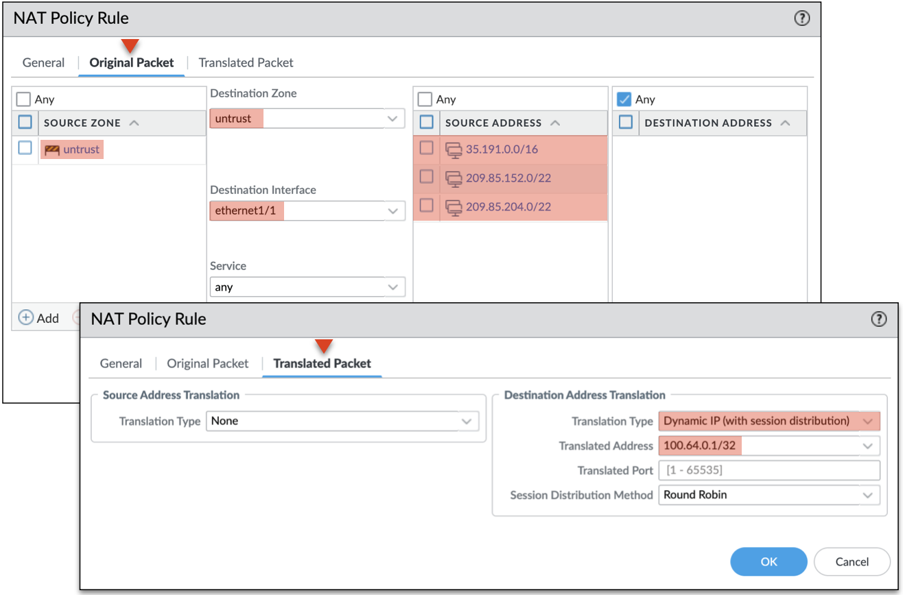

#### Create Security Policy for IPv4/IPv6 Health Checks

1. Go to **Policies → Security**. Click **Add**.

2. Configure the policy to allow IPv4 & IPv6 health check ranges to the `lb-checks` zone.
   
    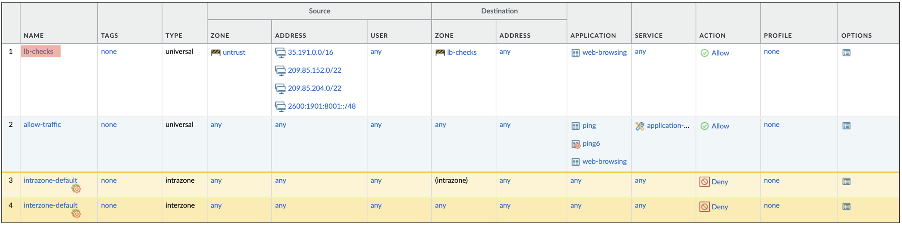

> [!Important]
> Move the policy to the top of the rule set before committing the changes.

3. **Commit the changes.**

4. In Google Cloud, verify the health checks are up on the `vmseries-extlb`. 
    
    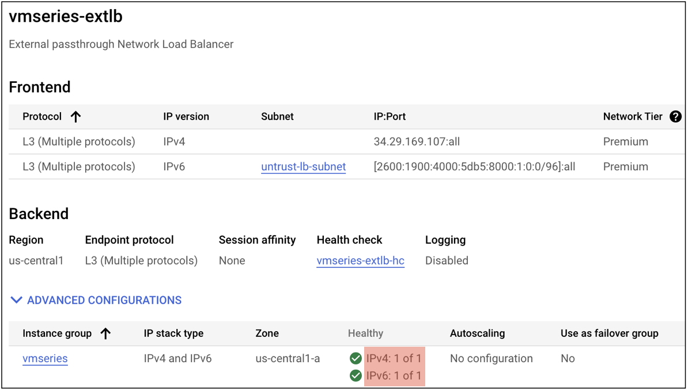


### Configure NAT Policy for IPv4 Forwarding Rule

Create a NAT policy to translate traffic destined to the IPv4 forwarding rule to a web app on the `internal-vm` in the trust VPC.

1. In Google Cloud, record IPv4 & IPv6 addresses of the `internal-vm`.
    
    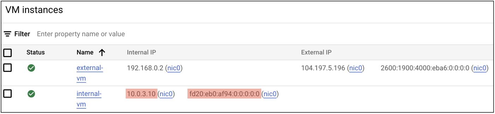

2. On the VM-Series, go to **Policies → NAT**. Click **Add**.  

3. Configure the policy to translate the IPv4 forwarding rule to the `internal-vm` IPv4 address.

    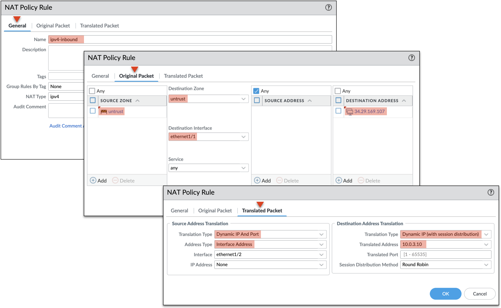

    | NAT Policy             |                       |                                               |
    |------------------------|-----------------------|-----------------------------------------------|
    | **Original Packet**    | Source Zone           | `untrust`                                     |
    |                        | Destination Zone      | `untrust`                                     |
    |                        | Destination Interface | `ethernet1/1`                                 |
    |                        | Destination Address   | `34.29.169.107` (IPv4 fowarding rule address) |
    | **Source Translation** | Translation Type      | `Dynamic IP and Port`                         |
    |                        | Address Type          | `Interface Address`                           |
    |                        | Interface             | `ethernet1/2`                                 |
    | **DST Translation**    | Translation Type      | `Dynamic IP`                                  |
    |                        | Translated Address    | `10.0.3.10` (IPv4 of `internal-vm`)           |


> [!IMPORTANT]  
> When load balancing internet inbound traffic through multiple firewalls, source translation is necessary to ensure a synchronous response from the backend application.


### Configure NPTv6 Policy for IPv6 Forwarding Rule
Create an NPTv6 policy to translate traffic destined to the IPv6 forwarding rule to the web app on `internal-vm`. 

> [!NOTE] 
> NPTv6 performs stateless translation, moving traffic from one IPv6 prefix to another by eliminating the IPv6 header checksum.
> Therefore, a checksum-neutral address must be calculated and used as the original packet's destination in the NPTv6 policy.

#### Generate Checksum Neutral Address on VM-Series 

1. In Cloud Shell, SSH to the VM-Series using its management IP. 

    ```
    ssh admin@1.1.1.1
    ```

2. Use the `test nptv6` command to generate the checksum for traffic between the IPv6 address of the `internal-vm` and the IPv6 forwarding rule address on the load balancer.

    ```
    test nptv6 cks-neutral source-ip fd20:eb0:af94:0:0:0:0:0 dest-network 2600:1900:4000:5db5:8000:1:0:0/96
    ```
    
    > Replace `fd20:eb0:af94:0:0:0:0:0` with the IPv6 address of your internal-vm and replace `2600:1900:4000:5db5:8000:1:0:0/96` with the IPv6 address assigned to your load balancer's forwarding rule. 
 

3. Record the generated checksum neutral address.
    
    **(Output)**
    <pre>
    The checksum neutral address of fd20:eb0:af94:: is <b>2600:1900:4000:5db5:8000:1:5eae:0</b> in 2600:1900:4000:5db5:8000:1:0:0/96 subnet
    </pre>


#### Create NPTv6 Policy

1. On the VM-Series, go to **Policies → NAT**. Click **Add**.  

2. Set **NAT Type** to `nptv6`.

2. Configure the policy to translate the checksum IP to the `internal-vm` IPv6 address.

    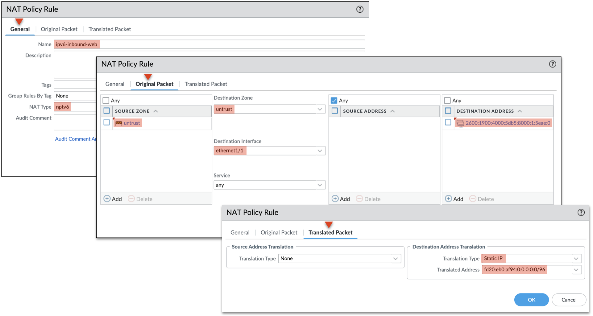

    | NPTv6 Policy           |                       |                                                                |
    |------------------------|-----------------------|----------------------------------------------------------------|
    | **Original Packet**    | Source Zone           | `untrust`                                                      |
    |                        | Destination Zone      | `untrust`                                                      |
    |                        | Destination Interface | `ethernet1/1`                                                  |
    |                        | Destination Address   | `2600:1900:4000:5db5:8000:1:5eae:0` (checksum neutral address) |
    | **DST Translation**    | Translation Type      | `Dynamic IP`                                                   |
    |                        | Translated Address    | `fd20:eb0:af94:0:0:0:0:0/96` (IPv6 of `internal-vm`)           |


### Test Inbound Internet Traffic

Access the `external-vm` to test internet inbound traffic through the IPv4/IPv6 external load balancer to the web application on `internal-vm`. 

1. In Cloud Shell, SSH to the external VM.

    ```
    gcloud compute ssh paloalto@external-vm  --zone=us-central1-a
    ```

2. Attempt to reach the web application using the load balancer's IPv4 address.

    ```
    curl http://34.29.169.107:80/?[1-3]
    ```

3. Attempt to reach the web application using the **checksum neutral** IPv6 address.

    ```
    curl -6 'http://[2600:1900:4000:5db5:8000:1:5eae:0]:80/?[1-3]'
    ```

4. On the VM-Series, go to **Monitor → Traffic**.  Enter the filter below to search for the inbound traffic. 

    ```
    ( zone.src eq 'untrust' ) and ( zone.dst eq 'trust' ) and ( app eq 'web-browsing' )
    ```
    
    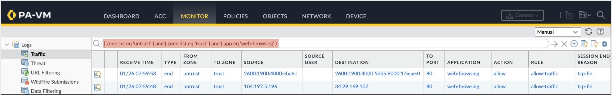

    > You should see that both IPv4 and IPv6 traffic is inspected and translated correctly by the VM-Series firewall.


## Clean up

1. To delete the created resources, run the commands below.

    ```
    gcloud compute routes delete ipv4-default -q
    gcloud compute routes delete ipv6-default -q
    terraform destroy
    ```

2. At the prompt to perform the actions, enter `yes`. 
   
   After all the resources are deleted, Terraform displays the following message:

    ```
    Destroy complete!
    ```

## Additional information

* Learn about the[ VM-Series on Google Cloud](https://docs.paloaltonetworks.com/vm-series/10-2/vm-series-deployment/set-up-the-vm-series-firewall-on-google-cloud-platform/about-the-vm-series-firewall-on-google-cloud-platform).
* Getting started with [Palo Alto Networks PAN-OS](https://docs.paloaltonetworks.com/pan-os). 
* Read about [securing Google Cloud Networks with the VM-Series](https://cloud.google.com/architecture/partners/palo-alto-networks-ngfw).
* Learn about [VM-Series licensing on all platforms](https://docs.paloaltonetworks.com/vm-series/10-2/vm-series-deployment/license-the-vm-series-firewall/vm-series-firewall-licensing.html#id8fea514c-0d85-457f-b53c-d6d6193df07c).
* Use the [VM-Series Terraform modules for Google Cloud](https://registry.terraform.io/modules/PaloAltoNetworks/vmseries-modules/google/latest). 
